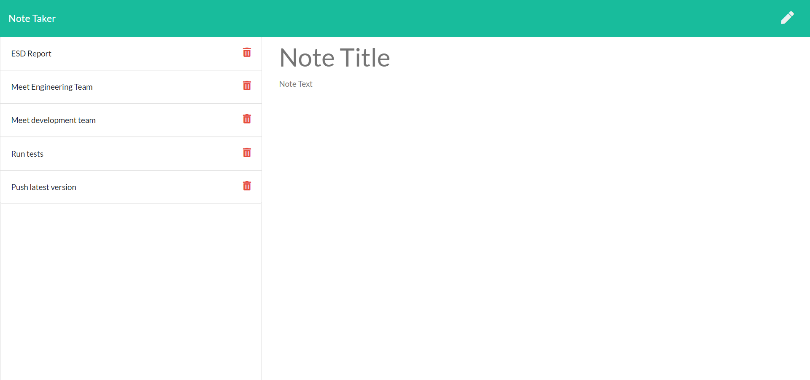

   
   
   
   
   
   
  

  # Welcome to Note Taker

  ## Table of Contents

  * [Description](#Description)
  * [Demonstration](#Demonstration)
  * [Setup](#Setup)
  * [Usage](#Usage)
  * [License](#License)
  * [Contributions](#Contributions)
  * [Version](#Version)
  * [Tests](#Tests)
  * [Questions](#Questions)

  ## Description

  This is an application to take and store notes. Notes can be deleted when no longer required. The application is hosted on heroku and can be accessed using a browser. Messages are stored on the server which runs using express.

  ## Live Application

  Access the live application [here](https://desolate-meadow-17602.herokuapp.com/).

  #### A screenshot of the application

  
  
  ## Setup

  No installation is required. The application can be accessed using the above link in a browser.

  ## Usage

  While on the application page, create a title and enter your notes. Hit the save button at the top right of the screen to save the note. A new note can be created by clicking on the pencil icon at the top right of the screen. Your notes will be displayed by title on the left panel. Click on any of them to view the contents or on the bin icon to delete them.

  ## License

  

  You may utilize this application under the terms of the [MIT license](assets/licences/MIT.txt).

  ## Contributions

  If you would like to add new features, make improvements or bug fixes, please make a pull request. I will review it and merge it into the application as necessary.

  ## Version

  

  ## Tests

  No tests are currently available.

  ## Questions

  If you have further questions or would like to see more features, please contact me via github or email:

  https://github.com/bdcoelho 

  ben_coelho@hotmail.com

  